<div align="center">

# 📍 SpotWise

**Discover · Plan · Travel**

A community travel-discovery app built with Flutter. Travellers share the places they
love; everyone else explores them on a map, saves and reviews them, plans trips — and
lets AI turn those real, community-approved spots into a day-by-day itinerary.

[](https://github.com/RamezMilad-1/spot_wise/actions/workflows/ci.yml)
[](https://flutter.dev)
[](LICENSE)
[](#-platforms)

<br/>

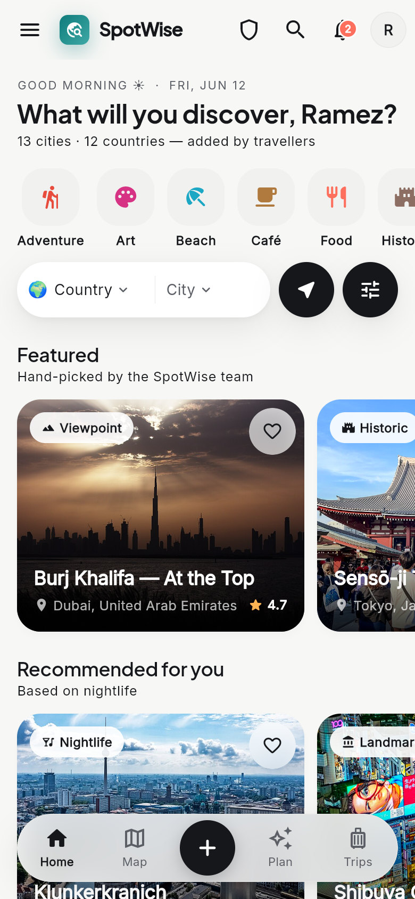
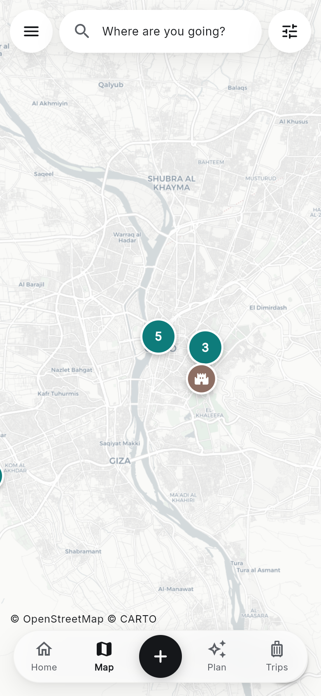
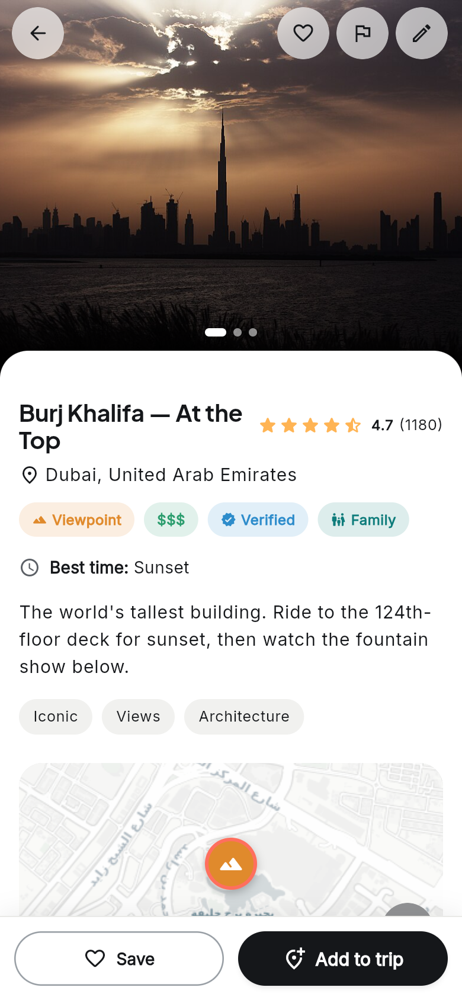
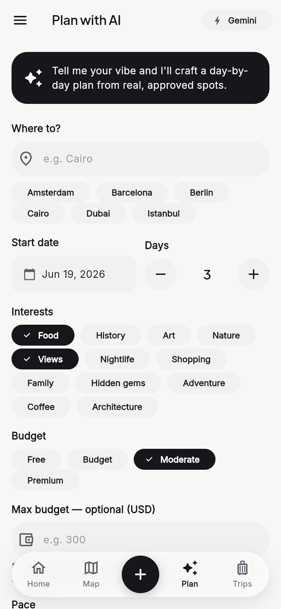

</div>

---

## ✨ What is SpotWise?

Think of it in three steps:

1. **Discover** — browse real places (cafés, beaches, viewpoints, hidden gems) shared by
   other travellers, organised by country and city, on a feed and a live map.
2. **Share** — add your own favourite spot with photos, a category and a GPS location,
   and leave reviews. Every submission is **admin-approved** before it goes public.
3. **Plan with AI** — tell the planner your dates, interests and budget and get a
   complete, costed, day-by-day trip built from the app's approved spots.

The app **opens straight into a browsable experience** — no login wall. Guests can explore
freely; signing in is only required for actions that belong to a user (save, review, add a
spot, generate a trip).

> 💡 **Runs with zero configuration.** Leave the `.env` keys blank and the app boots on
> built-in demo data (≈60 spots across 13 cities), using on-device storage and a local
> itinerary generator. Add keys when you want the real cloud backend and Gemini AI.

---

## 🌟 Highlights

| | Feature |
|---|---|
| 🗺️ | **Map-first discovery** — OpenStreetMap with marker **clustering**, custom category/photo pins, "locate me", and a "Where are you going?" city search (free Nominatim geocoding). |
| 🏠 | **Destination-first home** — pick a country & city or search anywhere, filter by category, plus a *Featured* rail and personalised *Recommended for you*. |
| 📸 | **Community submissions** — add a spot with **camera/gallery** photos, **GPS** capture or pick-on-map, then an admin moderation flow. |
| ⭐ | **Details, reviews & saves** — photo carousel, ratings, price tier, verified/family badges, mini-map, "Open in Google Maps", save & add-to-trip. |
| 🤖 | **AI trip planner** — Google **Gemini** grounded on approved spots → a scheduled, budget-aware itinerary. Falls back to an on-device generator with no key. |
| 🧳 | **Trip planner** — day-by-day stops with times, a **budget breakdown**, notes, and stop swapping. Saved offline with Hive. |
| 🔔 | **Notifications** — on-device reminders via `flutter_local_notifications` + FCM push on Android; in-app notification centre. |
| 🛡️ | **Admin panel** — moderation queue, manage all spots, manage users, categories, reports, and dashboard analytics. |
| 📴 | **Offline & resilient** — Hive cache, connectivity banner, and graceful empty/error/loading states throughout. |

<details>
<summary><b>More screenshots</b></summary>

<br/>

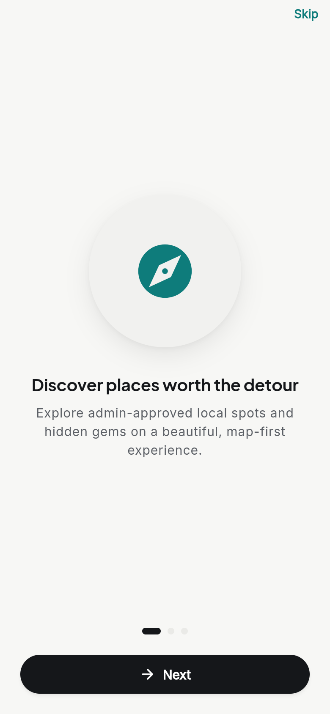
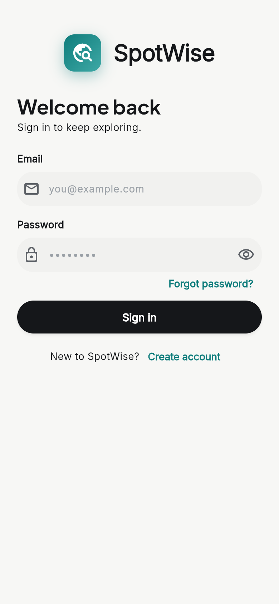
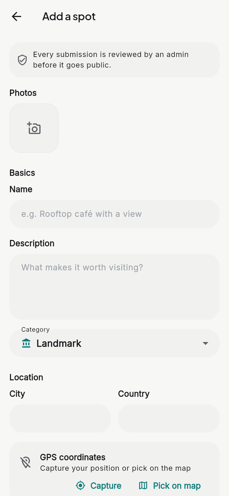
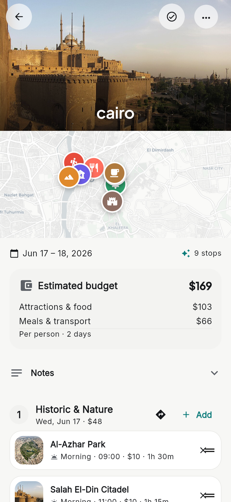
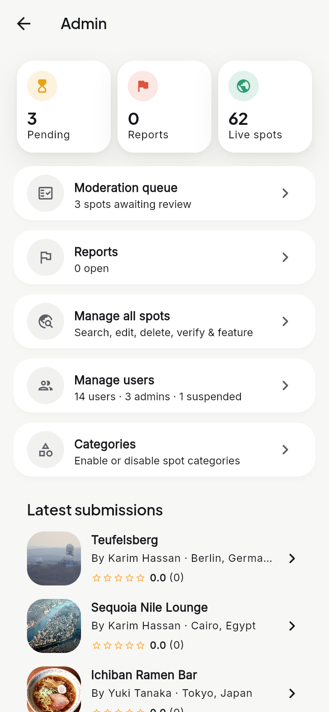
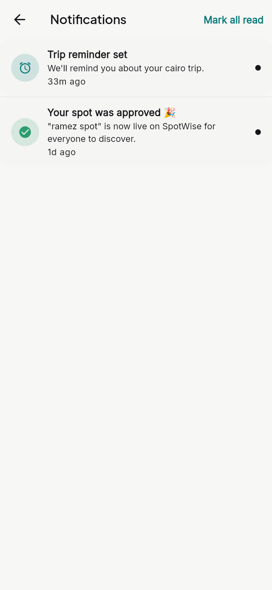
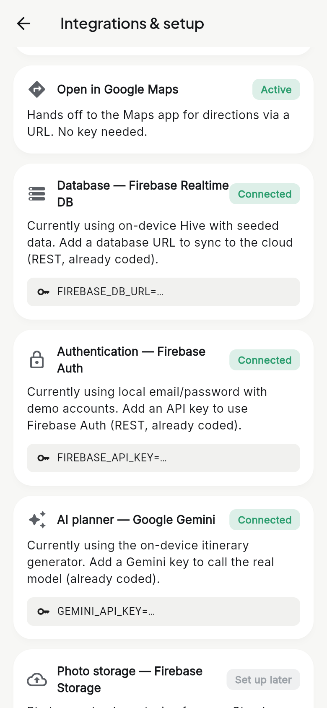
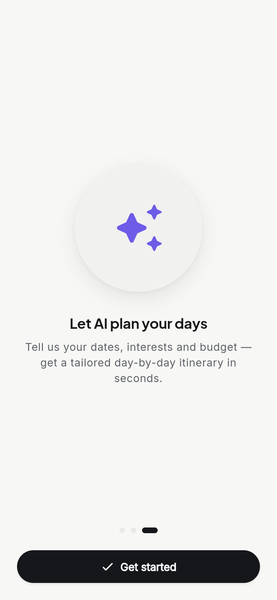

</details>

---

## 🧱 Tech stack

- **Framework:** Flutter (Dart 3.11) — one codebase for Android, Web & iOS.
- **State:** `provider` / `ChangeNotifier`, with a periodic-refresh stream for the live surface.
- **Backend:** Firebase **Realtime Database** over raw `http` + `dart:convert` (no SDK lock-in).
- **Auth:** Firebase Auth REST (Identity Toolkit), or a local Hive-backed auth with no network.
- **Maps:** `flutter_map` + `flutter_map_marker_cluster` on **OpenStreetMap**; `latlong2`.
  City search via free **Nominatim**; directions via `url_launcher` → Google Maps. *(No map API key, no billing.)*
- **AI:** Google **Gemini** (`generateContent` REST). Free tier; on-device fallback when no key.
- **Device:** `geolocator` (GPS), `image_picker` (camera/gallery), `path_provider`.
- **Storage/cache:** `hive` / `hive_flutter` (offline) + `shared_preferences` (session, filters, cache).
- **Notifications:** `firebase_messaging` (FCM) + `flutter_local_notifications`.
- **UI:** `google_fonts`, `cached_network_image`, `shimmer`, a custom design system.

Everything the app needs to run is on a **free / no-credit-card** path.

---

## 🗂 Architecture

Logic is isolated from UI so screens can be redesigned without touching data flow:

```
lib/
├── core/        # theme, config, routes, constants, error & helper utils
├── models/      # User, Spot, Review, Trip, Notification… (+ toJson/fromJson)
├── services/    # HTTP / Firebase / device calls only — no UI
├── providers/   # ChangeNotifier state — no UI
├── screens/     # one folder per feature (UI only)
├── widgets/     # shared widget catalog (SpotCard, AppButton, states…)
└── main.dart    # MultiProvider + router
```

**Rule:** screens read/write only through **providers**; providers call only **services**.
Each integration has a *local* and a *remote* implementation, picked automatically from
`.env` by a small service locator — so the same UI runs on mock data or the real cloud.

---

## 🚀 Getting started

**Prerequisites:** Flutter `3.41+` (Dart `3.11+`). Check with `flutter doctor`.

```bash
# 1. Clone
git clone https://github.com/RamezMilad-1/spot_wise.git
cd spot_wise

# 2. Create your env file (required — even if left blank)
cp .env.example .env

# 3. Install dependencies
flutter pub get

# 4. Run (Chrome, an Android device/emulator, etc.)
flutter run
```

> ⚠️ Step 2 is not optional: `.env` is git-ignored but declared as an asset, so the build
> needs the file to **exist**. Blank values are fine — the app runs on demo data.

### Try it instantly — demo accounts (local mode)

| Role | Email | Password |
|---|---|---|
| Explorer | `demo@spotwise.app` | `spotwise` |
| Admin | `admin@spotwise.app` | `spotwise` |

### Optional — connect the real backends

Fill any of these in `.env` to swap that integration from local mock to live (each is independent):

```env
FIREBASE_DB_URL=    # Firebase Realtime Database URL  → cloud database
FIREBASE_API_KEY=   # Firebase Web API key            → cloud auth
GEMINI_API_KEY=     # Google AI Studio key (free)     → real AI itineraries
```

---

## 📦 Platforms

- **Android** — primary target; build a release APK with `flutter build apk --release` and
  share via GitHub Releases (no Play Store account needed).
- **Web** — `flutter build web`; deployable for free (e.g. GitHub Pages).
- **iOS** — builds and runs; not distributed (avoids the paid Apple Developer Program).

---

## ✅ Quality

- `dart analyze` — clean, no issues.
- `flutter test` — unit tests for the trip estimator/itinerary generator + widget/JSON tests.
- CI runs analyze + tests on every push (see the badge above).

```bash
dart analyze
flutter test
```

---

## 🎓 What it demonstrates

| Capability | Where |
|---|---|
| Authentication + multiple user roles | Email/password auth; Explorer + Admin |
| Many screens + rich navigation | Bottom dock + tabs + side drawer + named routes |
| Online database | Firebase Realtime DB over HTTP |
| Push notifications | FCM + on-device local notifications |
| Device features | GPS (geolocator) + camera/gallery (image_picker) |
| Persistent storage, providers, caching | Hive + SharedPreferences; Provider; periodic stream |
| Error handling | Connectivity, validation, upload & server-error states everywhere |
| AI component | Gemini itinerary planner grounded on approved spots |
| Beyond-scope extras | AI planner · map clustering + custom markers · recommendations · offline trips |

---

## 🗺 Roadmap

- 💬 1-to-1 messaging with a spot's contributor (screen reserved, post-MVP).
- ☁️ Cloud photo storage (Firebase Storage) for cross-device community photos.
- 🔁 Upgrade the live surface from periodic refresh to true realtime streaming.

---

## 👥 Authors

Built by **Ramez Milad** and **Marwan Moamen**.

## 📄 License

Released under the [MIT License](LICENSE).
